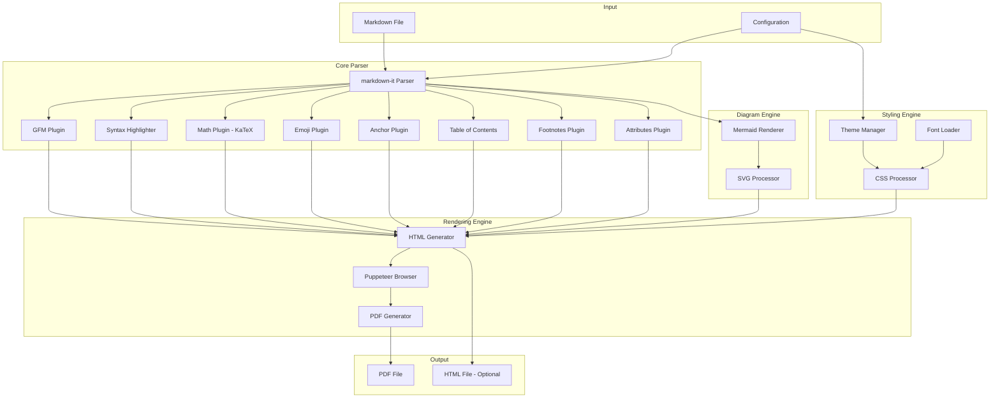
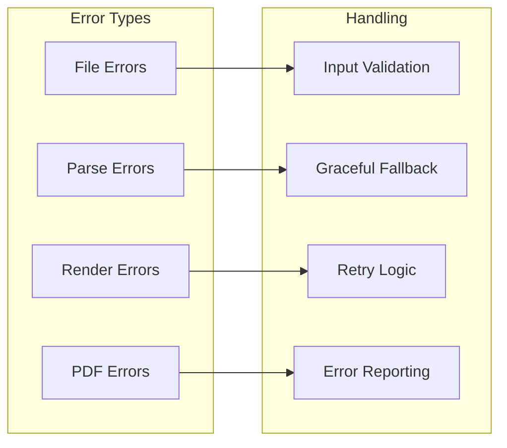
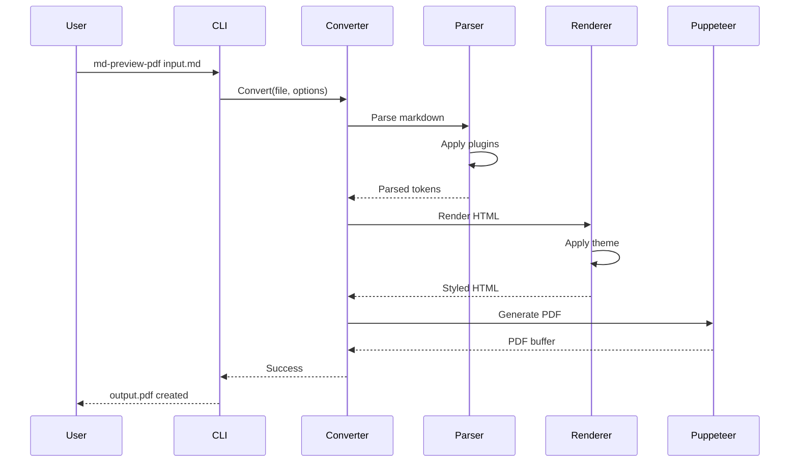

# MD Preview PDF Converter Architecture

## Overview

A state-of-the-art Markdown to PDF converter that preserves the exact visual appearance of markdown previews, including support for Mermaid diagrams, syntax highlighting, math equations, icons, and GitHub Flavored Markdown.

## Architecture Diagram



## Component Details

### 1. Input Layer
- **Markdown File**: Source `.md` file with all markdown features
- **Configuration**: User-defined settings (theme, page size, margins, etc.)

### 2. Core Parser (markdown-it based)
- **GFM Plugin**: GitHub Flavored Markdown support
  - Tables
  - Task lists
  - Strikethrough
  - Autolinks
- **Syntax Highlighter**: Code block highlighting using highlight.js
- **Math Plugin**: LaTeX math rendering via KaTeX
- **Emoji Plugin**: GitHub-style emoji support (:emoji:)
- **Anchor Plugin**: Header anchors for navigation
- **TOC Plugin**: Auto-generated table of contents
- **Footnotes Plugin**: Footnote support
- **Attributes Plugin**: Custom attributes on elements

### 3. Diagram Engine
- **Mermaid Renderer**: Render mermaid diagrams to SVG
  - Flowcharts
  - Sequence diagrams
  - Gantt charts
  - Class diagrams
  - State diagrams
  - Entity Relationship diagrams
  - User Journey diagrams
  - Pie charts
  - Git graphs
- **SVG Processor**: Optimize and embed SVGs

### 4. Styling Engine
- **Theme Manager**: Multiple themes (GitHub, VS Code Dark/Light)
- **CSS Processor**: Apply consistent styling
- **Font Loader**: Web fonts for consistent rendering

### 5. Rendering Engine
- **HTML Generator**: Convert parsed markdown to styled HTML
- **Puppeteer Browser**: Headless Chrome for rendering
- **PDF Generator**: High-fidelity PDF output

## Technology Stack

| Component | Technology | Purpose |
|-----------|------------|---------|
| Runtime | Node.js 18+ | JavaScript runtime |
| Language | TypeScript | Type safety and better DX |
| MD Parser | markdown-it | Extensible markdown parser |
| Syntax Highlighting | highlight.js | Code highlighting |
| Math Rendering | KaTeX | LaTeX math equations |
| Diagrams | Mermaid | Diagram rendering |
| PDF Generation | Puppeteer | Headless browser |
| CLI | Commander.js | Command-line interface |
| Testing | Jest | Unit and integration tests |

## Error Handling Strategy



## File Structure

```
md-preview-pdf/
├── src/
│   ├── index.ts              # Main entry point
│   ├── cli.ts                # CLI interface
│   ├── converter.ts          # Main converter class
│   ├── parser/
│   │   ├── index.ts          # Parser factory
│   │   ├── markdown-parser.ts # Markdown-it setup
│   │   └── plugins/          # Custom plugins
│   ├── renderers/
│   │   ├── html-renderer.ts  # HTML generation
│   │   ├── mermaid-renderer.ts # Mermaid diagrams
│   │   └── pdf-renderer.ts   # PDF generation
│   ├── themes/
│   │   ├── github.css        # GitHub theme
│   │   ├── vscode-dark.css   # VS Code dark theme
│   │   └── vscode-light.css  # VS Code light theme
│   ├── utils/
│   │   ├── file-utils.ts     # File operations
│   │   ├── error-handler.ts  # Error handling
│   │   └── logger.ts         # Logging utility
│   └── types/
│       └── index.ts          # TypeScript types
├── tests/
│   ├── samples/              # Test markdown files
│   └── *.test.ts             # Test files
├── package.json
├── tsconfig.json
├── README.md
└── ARCHITECTURE.md
```

## Supported Markdown Features

### Standard Markdown
- [x] Headers (H1-H6)
- [x] Paragraphs
- [x] Bold, Italic, Strikethrough
- [x] Lists (ordered, unordered, nested)
- [x] Links and Images
- [x] Blockquotes
- [x] Code blocks and inline code
- [x] Horizontal rules

### GitHub Flavored Markdown (GFM)
- [x] Tables
- [x] Task lists
- [x] Strikethrough
- [x] Autolinks
- [x] Emoji shortcodes

### Extended Features
- [x] Mermaid diagrams
- [x] Math equations (KaTeX)
- [x] Syntax highlighting (150+ languages)
- [x] Footnotes
- [x] Table of contents
- [x] Custom containers
- [x] Definition lists
- [x] Abbreviations

## PDF Configuration Options

```typescript
interface PDFOptions {
  format?: 'A4' | 'Letter' | 'Legal';
  margin?: {
    top?: string;
    right?: string;
    bottom?: string;
    left?: string;
  };
  headerTemplate?: string;
  footerTemplate?: string;
  displayHeaderFooter?: boolean;
  printBackground?: boolean;
  landscape?: boolean;
  pageRanges?: string;
  scale?: number;
}
```

## Usage Workflow


