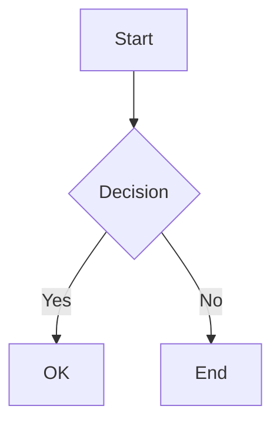

# MD Preview PDF 📄

A state-of-the-art Markdown to PDF converter that preserves the exact visual appearance of markdown previews, including full support for Mermaid diagrams, syntax highlighting, math equations, and GitHub Flavored Markdown.

[](https://opensource.org/licenses/MIT)
[](https://nodejs.org/)
[](https://www.typescriptlang.org/)
[](https://eslint.org/)


## ✨ Features

- **Full Markdown Support**: Complete GFM (GitHub Flavored Markdown) support
- **Mermaid Diagrams**: Flowcharts, sequence diagrams, class diagrams, and more
- **Syntax Highlighting**: 150+ programming languages with beautiful themes
- **Math Equations**: LaTeX math rendering via KaTeX
- **Multiple Themes**: GitHub (light/dark), VS Code (light/dark)
- **Table of Contents**: Auto-generated TOC with customizable depth
- **Task Lists**: Checkbox support for TODO lists
- **Footnotes**: Full footnote support
- **Custom Containers**: Tips, warnings, info boxes, and more
- **Emoji Support**: Convert `:emoji:` shortcodes to unicode
- **High-Fidelity Output**: Uses Puppeteer for pixel-perfect PDF generation

### What's new in v1.1.0
- Render YAML front matter as an HTML table in generated PDFs for clearer metadata presentation
- Comprehensive security hardening (SRI for CDNs, improved escaping, stricter Mermaid security level)
- Refactored CSS rendering into dedicated modules for improved maintainability

## 📦 Installation

### From Source (Development)

```bash
# Clone the repository
git clone https://github.com/anuragkr29/md-preview-pdf.git
cd md-preview-pdf

# Install dependencies
npm install

# Build the project
npm run build

# Link for global CLI usage (optional)
npm link
```

### From NPM

```bash
# Global installation
npm install -g md-preview-pdf

# Local installation
npm install md-preview-pdf
```

## 🚀 Quick Start

### Command Line

```bash
# Basic conversion
md-preview-pdf document.md

# Specify output file
md-preview-pdf document.md output.pdf

# Use dark theme
md-preview-pdf document.md --theme github-dark

# Add page numbers
md-preview-pdf document.md --page-numbers

# Generate table of contents
md-preview-pdf document.md --toc

# TOC with custom depth
md-preview-pdf document.md --toc --toc-depth 2
```

> **Note**: Table of contents generation requires a `${toc}` marker in your markdown file where you want the TOC to appear. Example:
> ```markdown
> # My Document
> 
> ${toc}
> 
> ## Section 1
> Content here...
> ```

### Programmatic Usage

```typescript
import { Converter, convert } from 'md-preview-pdf';

// Quick convert
const result = await convert('document.md', 'output.pdf', {
  theme: { name: 'github' },
  pdf: { format: 'A4' },
});

// Using the Converter class
const converter = new Converter({
  theme: { name: 'github-dark' },
  toc: true,
  math: true,
});

const result = await converter.convertFile('input.md', 'output.pdf');
console.log(`PDF generated: ${result.outputPath}`);

// Don't forget to cleanup
await converter.cleanup();
```

## 📋 CLI Options

| Option | Description | Default |
|--------|-------------|---------|
| `-t, --theme <theme>` | Theme (github, github-dark, vscode-light, vscode-dark) | `github` |
| `-f, --format <format>` | Page format (A4, A3, A5, Letter, Legal, Tabloid) | `A4` |
| `--landscape` | Use landscape orientation | `false` |
| `--no-background` | Disable background printing | `true` |
| `-m, --margin <margin>` | Page margins (e.g., "20mm" or "10mm,15mm,20mm,15mm") | `20mm` |
| `--toc` | Generate table of contents | `false` |
| `--toc-depth <depth>` | TOC heading depth (1-6) | `3` |
| `--html` | Also output HTML file | `false` |
| `--no-math` | Disable KaTeX math rendering | `true` |
| `--no-emoji` | Disable emoji conversion | `true` |
| `--no-highlight` | Disable syntax highlighting | `true` |
| `--mermaid-theme <theme>` | Mermaid theme (default, forest, dark, neutral, base) | `default` |
| `--header <template>` | Custom header HTML template | - |
| `--footer <template>` | Custom footer HTML template | - |
| `--page-numbers` | Add page numbers to footer | `false` |
| `--css <path>` | Custom CSS file path | - |
| `--debug` | Run in debug mode (show browser) | `false` |
| `-v, --verbose` | Verbose output | `false` |
| `-q, --quiet` | Quiet mode | `false` |

## 🎨 Themes

List available themes:

```bash
md-preview-pdf themes
```

### Available Themes

- **github**: GitHub light theme (default)
- **github-dark**: GitHub dark theme
- **vscode-light**: VS Code light theme
- **vscode-dark**: VS Code dark theme

### Customizing Theme Styling

Themes use a modular architecture with separate color palettes and CSS styling:

**Structure:**
- Color palettes: `src/themes/colors/*.ts` (defines CSS variables)
- Theme CSS: `src/themes/*.ts` (imports colors and applies styling)

**Available Themes:**

1. **GitHub Light Theme**
   - Colors: [src/themes/colors/github-colors.ts](src/themes/colors/github-colors.ts)
   - CSS: [src/themes/github.ts](src/themes/github.ts)
   - Primary colors: `--bgColor-default: #ffffff`, `--fgColor-default: #1f2328`

2. **GitHub Dark Theme**
   - Colors: [src/themes/colors/github-dark-colors.ts](src/themes/colors/github-dark-colors.ts)
   - CSS: [src/themes/github-dark.ts](src/themes/github-dark.ts)
   - Primary colors: `--bgColor-default: #0d1117`, `--fgColor-default: #e6edf3`

3. **VS Code Light Theme**
   - Colors: [src/themes/colors/vscode-light-colors.ts](src/themes/colors/vscode-light-colors.ts)
   - CSS: [src/themes/vscode-light.ts](src/themes/vscode-light.ts)
   - Primary colors: `--bgColor-default: #ffffff`, `--fgColor-default: #333333`

4. **VS Code Dark Theme**
   - Colors: [src/themes/colors/vscode-dark-colors.ts](src/themes/colors/vscode-dark-colors.ts)
   - CSS: [src/themes/vscode-dark.ts](src/themes/vscode-dark.ts)
   - Primary colors: `--bgColor-default: #1e1e1e`, `--fgColor-default: #d4d4d4`

**To customize a theme:**

1. Edit color values in the appropriate `colors/*.ts` file (uses CSS custom properties)
2. Modify styling rules in the theme's main `.ts` file if needed
3. Rebuild and test:

```bash
npm run build
md-preview-pdf tests/samples/simple-test.md output.pdf --theme github-dark
```

This modular approach separates color definitions from styling logic, making themes easier to maintain and extend.

### Sample Output

The following PDFs demonstrate the output quality across all themes:

| Theme | Simple Test | File Size |
|-------|-------------|-----------|
| [GitHub Light](tests/output/examples/simple-github.pdf) | [View](tests/output/examples/simple-github.pdf) | 130 KB |
| [GitHub Dark](tests/output/examples/simple-github-dark.pdf) | [View](tests/output/examples/simple-github-dark.pdf) | 130 KB |
| [VS Code Light](tests/output/examples/simple-vscode-light.pdf) | [View](tests/output/examples/simple-vscode-light.pdf) | 134 KB |
| [VS Code Dark](tests/output/examples/simple-vscode-dark.pdf) | [View](tests/output/examples/simple-vscode-dark.pdf) | 134 KB |

## 📊 Supported Mermaid Diagrams





Supported diagram types:
- Flowcharts
- Sequence diagrams
- Class diagrams
- State diagrams
- Entity Relationship diagrams
- Gantt charts (full-width rendering)
- Pie charts
- Git graphs
- User Journey diagrams

### Mermaid Themes and Configuration

The converter automatically selects the appropriate Mermaid theme based on your document theme:

| Document Theme | Mermaid Theme |
|---|---|
| `github` | `default` |
| `github-dark` | `dark` |
| `vscode-light` | `default` |
| `vscode-dark` | `dark` |

You can also explicitly set the Mermaid theme via CLI:

```bash
# Use forest theme
md-preview-pdf document.md --mermaid-theme forest

# Use neutral theme
md-preview-pdf document.md --mermaid-theme neutral
```

**Available Mermaid themes**: `default`, `forest`, `dark`, `neutral`, `base`

> **Note**: Invalid theme names will trigger a warning and fallback to the `default` theme automatically.


## ➗ Math Equations

Inline math with single dollar signs:

```markdown
The formula $E = mc^2$ is famous.
```

Block math with double dollar signs:

```markdown
$$
\int_{a}^{b} f(x) \, dx = F(b) - F(a)
$$
```

## 📝 Front Matter

Use YAML front matter to configure document-specific options:

```yaml
---
title: "My Document"
author: "John Doe"
date: "2024-01-01"
pdfs:
  format: Letter
  margin:
    top: "25mm"
    bottom: "25mm"
---
```

In v1.1.0 the YAML front matter is also rendered as an HTML table in the generated PDF, providing a clear metadata summary at the top of the document.

## 📁 Custom Containers

```markdown
::: tip Pro Tip
This is a helpful tip!
:::

::: warning Warning
Be careful about this!
:::

::: danger Danger
This is critical!
:::

::: info Information
Here's some additional info.
:::

::: details Click to expand
Hidden content here...
:::
```

## 🛠️ Development

```bash
# Install dependencies
npm install

# Build
npm run build

# Run tests
npm test

# Run in development mode
npm run dev -- input.md

# Lint code
npm run lint
```

## 🔧 API Reference

### Converter Class

```typescript
class Converter {
  constructor(options?: ConverterOptions);
  
  // Convert markdown file to PDF
  convertFile(input: string, output?: string): Promise<ConversionResult>;
  
  // Convert markdown string to PDF buffer
  convertString(markdown: string, basePath?: string): Promise<Buffer>;
  
  // Convert multiple files
  convertFiles(inputs: string[], outputDir?: string): Promise<ConversionResult[]>;
  
  // Generate HTML from markdown
  generateHtml(markdown: string, basePath?: string): Promise<string>;
  
  // Parse markdown without rendering
  parseMarkdown(markdown: string): ParsedMarkdown;
  
  // Update options
  setOptions(options: Partial<ConverterOptions>): void;
  
  // Get current options
  getOptions(): ConverterOptions;
  
  // Clean up resources
  cleanup(): Promise<void>;
}
```

### ConverterOptions

```typescript
interface ConverterOptions {
  pdf?: PDFOptions;           // PDF generation options
  theme?: ThemeOptions;       // Theme configuration
  mermaid?: MermaidOptions;   // Mermaid diagram options
  toc?: boolean;              // Enable table of contents
  tocDepth?: number;          // TOC depth (1-6)
  outputHtml?: boolean;       // Also output HTML
  math?: boolean;             // Enable KaTeX math
  emoji?: boolean;            // Enable emoji conversion
  highlight?: boolean;        // Enable syntax highlighting
  basePath?: string;          // Base path for relative resources
  debug?: boolean;            // Debug mode
}
```
## 💻 System Requirements

### Minimum Requirements
- **Node.js**: >= 18.0.0
- **npm**: >= 8.0.0
- **Memory**: 512MB minimum (1GB+ recommended for large documents)

### Operating System Compatibility

#### macOS
- **Minimum**: macOS 11 (Big Sur) or later
- **Why**: Bundled Chromium requires macOS 11+
- **Older Macs**: For macOS 10.x, install Google Chrome manually and the tool will automatically use it

#### Windows
- **Minimum**: Windows 10 (version 1809) or later
- **Why**: Bundled Chromium requires Windows 10 1809+
- **Older Windows**: Install Google Chrome manually for compatibility

#### Linux
- **Most distributions supported** (Ubuntu 18.04+, Debian 10+, Fedora 32+, etc.)
- Required system packages may vary by distribution
- See [Puppeteer system requirements](https://github.com/puppeteer/puppeteer/blob/main/docs/troubleshooting.md) for details

### Browser Requirements

This tool uses Puppeteer which automatically downloads Chromium. However, if the bundled Chromium is incompatible with your system:

1. **Install Google Chrome** (recommended): The tool will automatically detect and use it
2. **Set custom Chrome path**:
   ```bash
   export PUPPETEER_EXECUTABLE_PATH="/path/to/chrome"
   ```

## 🔧 Troubleshooting

### "dyld: cannot load 'Google Chrome for Testing'" (macOS)

**Problem**: This error occurs on macOS 10.x (Catalina and older) because the bundled Chromium requires macOS 11+.

**Solution**:
1. Install [Google Chrome](https://www.google.com/chrome/) from the official website
2. The tool will automatically detect and use your system Chrome installation
3. Alternatively, set the Chrome path manually:
   ```bash
   export PUPPETEER_EXECUTABLE_PATH="/Applications/Google Chrome.app/Contents/MacOS/Google Chrome"
   md-preview-pdf document.md
   ```

### "Failed to launch the browser process" (Windows)

**Problem**: Bundled Chromium incompatible with older Windows versions.

**Solution**:
1. Install [Google Chrome](https://www.google.com/chrome/)
2. Or set Chrome path:
   ```bash
   set PUPPETEER_EXECUTABLE_PATH="C:\Program Files\Google\Chrome\Application\chrome.exe"
   md-preview-pdf document.md
   ```

### Out of Memory Errors

**Problem**: Large documents exhaust available memory.

**Solution**:
1. Increase Node.js memory limit:
   ```bash
   export NODE_OPTIONS="--max-old-space-size=4096"
   md-preview-pdf large-document.md
   ```
2. Split large documents into smaller files
3. Disable resource-intensive features:
   ```bash
   md-preview-pdf document.md --no-highlight --no-math
   ```

### Slow Performance

**Tips**:
- First conversion is slower (Chromium downloads)
- Use `--no-mermaid` if you don't have diagrams
- Disable unused features (`--no-math`, `--no-emoji`, `--no-highlight`)
- Consider SSD for faster file I/O

### Getting Help

1. Check [Puppeteer troubleshooting](https://github.com/puppeteer/puppeteer/blob/main/docs/troubleshooting.md)
2. Search [existing issues](https://github.com/anuragkr29/md-preview-pdf/issues)
3. Create a [new issue](https://github.com/anuragkr29/md-preview-pdf/issues/new) with:
   - Operating system and version
   - Node.js version (`node --version`)
   - Full error message
   - Command that failed


## 🧪 Testing

```bash
# Run all tests
npm test

# Run tests with coverage
npm test -- --coverage

# Run tests in watch mode
npm test -- --watch
```

## 📄 License

MIT License - see [LICENSE](LICENSE) for details.

## 🤝 Contributing

Contributions are welcome! Please feel free to submit a Pull Request.

1. Fork the repository
2. Create your feature branch (`git checkout -b feature/amazing-feature`)
3. Commit your changes (`git commit -m 'Add amazing feature'`)
4. Push to the branch (`git push origin feature/amazing-feature`)
5. Open a Pull Request

## 🙏 Acknowledgments

- [markdown-it](https://github.com/markdown-it/markdown-it) - Markdown parser
- [Puppeteer](https://pptr.dev/) - Headless Chrome for PDF generation
- [Mermaid](https://mermaid.js.org/) - Diagram rendering
- [KaTeX](https://katex.org/) - Math rendering
- [highlight.js](https://highlightjs.org/) - Syntax highlighting

---

**Created by [Anurag Kumar](https://github.com/anuragkr29)**

**Repository**: [md-preview-pdf](https://github.com/anuragkr29/md-preview-pdf)
