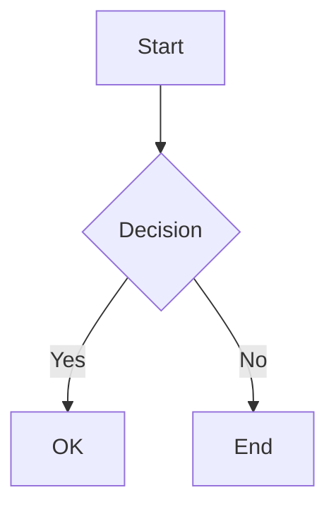

# MD Preview PDF 📄

A state-of-the-art Markdown to PDF converter that preserves the exact visual appearance of markdown previews, including full support for Mermaid diagrams, syntax highlighting, math equations, and GitHub Flavored Markdown.

[](https://opensource.org/licenses/MIT)
[](https://nodejs.org/)
[](https://www.typescriptlang.org/)
[](https://eslint.org/)


## ✨ Features

- **Full Markdown Support**: Complete GFM (GitHub Flavored Markdown) support
- **Mermaid Diagrams**: Flowcharts, sequence diagrams, class diagrams, and more
- **Syntax Highlighting**: 150+ programming languages with beautiful themes
- **Math Equations**: LaTeX math rendering via KaTeX
- **Multiple Themes**: GitHub (light/dark), VS Code (light/dark)
- **Table of Contents**: Auto-generated TOC with customizable depth
- **Task Lists**: Checkbox support for TODO lists
- **Footnotes**: Full footnote support
- **Custom Containers**: Tips, warnings, info boxes, and more
- **Emoji Support**: Convert `:emoji:` shortcodes to unicode
- **High-Fidelity Output**: Uses Puppeteer for pixel-perfect PDF generation

## 📦 Installation

### From Source (Development)

```bash
# Clone the repository
git clone https://github.com/anuragkr29/md-preview-pdf.git
cd md-preview-pdf

# Install dependencies
npm install

# Build the project
npm run build

# Link for global CLI usage (optional)
npm link
```

### From NPM

```bash
# Global installation
npm install -g md-preview-pdf

# Local installation
npm install md-preview-pdf
```

## 🚀 Quick Start

### Command Line

```bash
# Basic conversion
md-preview-pdf document.md

# Specify output file
md-preview-pdf document.md output.pdf

# Use dark theme
md-preview-pdf document.md --theme github-dark

# Add page numbers
md-preview-pdf document.md --page-numbers

# Generate table of contents
md-preview-pdf document.md --toc
```

### Programmatic Usage

```typescript
import { Converter, convert } from 'md-preview-pdf';

// Quick convert
const result = await convert('document.md', 'output.pdf', {
  theme: { name: 'github' },
  pdf: { format: 'A4' },
});

// Using the Converter class
const converter = new Converter({
  theme: { name: 'github-dark' },
  toc: true,
  math: true,
});

const result = await converter.convertFile('input.md', 'output.pdf');
console.log(`PDF generated: ${result.outputPath}`);

// Don't forget to cleanup
await converter.cleanup();
```

## 📋 CLI Options

| Option | Description | Default |
|--------|-------------|---------|
| `-t, --theme <theme>` | Theme (github, github-dark, vscode-light, vscode-dark) | `github` |
| `-f, --format <format>` | Page format (A4, A3, A5, Letter, Legal, Tabloid) | `A4` |
| `--landscape` | Use landscape orientation | `false` |
| `--no-background` | Disable background printing | `true` |
| `-m, --margin <margin>` | Page margins (e.g., "20mm" or "10mm,15mm,20mm,15mm") | `20mm` |
| `--toc` | Generate table of contents | `false` |
| `--toc-depth <depth>` | TOC heading depth (1-6) | `3` |
| `--html` | Also output HTML file | `false` |
| `--no-math` | Disable KaTeX math rendering | `true` |
| `--no-emoji` | Disable emoji conversion | `true` |
| `--no-highlight` | Disable syntax highlighting | `true` |
| `--mermaid-theme <theme>` | Mermaid theme (default, forest, dark, neutral) | `default` |
| `--header <template>` | Custom header HTML template | - |
| `--footer <template>` | Custom footer HTML template | - |
| `--page-numbers` | Add page numbers to footer | `false` |
| `--css <path>` | Custom CSS file path | - |
| `--debug` | Run in debug mode (show browser) | `false` |
| `-v, --verbose` | Verbose output | `false` |
| `-q, --quiet` | Quiet mode | `false` |

## 🎨 Themes

List available themes:

```bash
md-preview-pdf themes
```

### Available Themes

- **github**: GitHub light theme (default)
- **github-dark**: GitHub dark theme
- **vscode-light**: VS Code light theme
- **vscode-dark**: VS Code dark theme

### Customizing Theme Styling

Each theme is defined as a CSS string in the `src/themes/` directory. To customize a theme:

1. **GitHub Light Theme** (`src/themes/github.ts`)
   - Background color: `#ffffff` (white)
   - Text color: `#24292f` (dark gray)
   - Edit the `.markdown-body` styling and color variables

2. **GitHub Dark Theme** (`src/themes/github-dark.ts`)
   - Background color: `#0d1117` (very dark gray)
   - Text color: `#c9d1d9` (light gray)
   - Edit the `.markdown-body` styling and color variables

3. **VS Code Light Theme** (`src/themes/vscode-light.ts`)
   - Background color: `#ffffff` (white)
   - Text color: `#333333` (dark gray)
   - Edit the `.markdown-body` styling to match VS Code light theme

4. **VS Code Dark Theme** (`src/themes/vscode-dark.ts`)
   - Background color: `#1e1e1e` (VS Code dark)
   - Text color: `#d4d4d4` (light gray)
   - Edit the `.markdown-body` styling to match VS Code dark theme

To test your theme changes:
```bash
npm run build
md-preview-pdf tests/samples/simple-test.md output.pdf --theme github-dark
```

### Sample Output

The following PDFs demonstrate the output quality across all themes:

| Theme | Simple Test | File Size |
|-------|-------------|-----------|
| [GitHub Light](tests/output/examples/simple-github.pdf) | [View](tests/output/examples/simple-github.pdf) | 130 KB |
| [GitHub Dark](tests/output/examples/simple-github-dark.pdf) | [View](tests/output/examples/simple-github-dark.pdf) | 130 KB |
| [VS Code Light](tests/output/examples/simple-vscode-light.pdf) | [View](tests/output/examples/simple-vscode-light.pdf) | 134 KB |
| [VS Code Dark](tests/output/examples/simple-vscode-dark.pdf) | [View](tests/output/examples/simple-vscode-dark.pdf) | 134 KB |

## 📊 Supported Mermaid Diagrams





Supported diagram types:
- Flowcharts
- Sequence diagrams
- Class diagrams
- State diagrams
- Entity Relationship diagrams
- Gantt charts
- Pie charts
- Git graphs
- User Journey diagrams

## ➗ Math Equations

Inline math with single dollar signs:

```markdown
The formula $E = mc^2$ is famous.
```

Block math with double dollar signs:

```markdown
$$
\int_{a}^{b} f(x) \, dx = F(b) - F(a)
$$
```

## 📝 Front Matter

Use YAML front matter to configure document-specific options:

```yaml
---
title: "My Document"
author: "John Doe"
date: "2024-01-01"
pdf:
  format: Letter
  margin:
    top: "25mm"
    bottom: "25mm"
theme: github-dark
---
```

## 📁 Custom Containers

```markdown
::: tip Pro Tip
This is a helpful tip!
:::

::: warning Warning
Be careful about this!
:::

::: danger Danger
This is critical!
:::

::: info Information
Here's some additional info.
:::

::: details Click to expand
Hidden content here...
:::
```

## 🛠️ Development

```bash
# Install dependencies
npm install

# Build
npm run build

# Run tests
npm test

# Run in development mode
npm run dev -- input.md

# Lint code
npm run lint
```

## 📂 Project Structure

```
md-preview-pdf/
├── src/
│   ├── index.ts              # Main entry point
│   ├── cli.ts                # CLI interface
│   ├── converter.ts          # Main converter class
│   ├── parser/               # Markdown parsing
│   ├── renderers/            # HTML/PDF/Mermaid rendering
│   ├── themes/               # CSS themes
│   ├── utils/                # Utilities
│   └── types/                # TypeScript types
├── tests/
│   ├── samples/              # Test markdown files
│   └── *.test.ts             # Test files
├── package.json
├── tsconfig.json
└── README.md
```

## 🔧 API Reference

### Converter Class

```typescript
class Converter {
  constructor(options?: ConverterOptions);
  
  // Convert markdown file to PDF
  convertFile(input: string, output?: string): Promise<ConversionResult>;
  
  // Convert markdown string to PDF buffer
  convertString(markdown: string, basePath?: string): Promise<Buffer>;
  
  // Convert multiple files
  convertFiles(inputs: string[], outputDir?: string): Promise<ConversionResult[]>;
  
  // Generate HTML from markdown
  generateHtml(markdown: string, basePath?: string): Promise<string>;
  
  // Parse markdown without rendering
  parseMarkdown(markdown: string): ParsedMarkdown;
  
  // Update options
  setOptions(options: Partial<ConverterOptions>): void;
  
  // Get current options
  getOptions(): ConverterOptions;
  
  // Clean up resources
  cleanup(): Promise<void>;
}
```

### ConverterOptions

```typescript
interface ConverterOptions {
  pdf?: PDFOptions;           // PDF generation options
  theme?: ThemeOptions;       // Theme configuration
  mermaid?: MermaidOptions;   // Mermaid diagram options
  toc?: boolean;              // Enable table of contents
  tocDepth?: number;          // TOC depth (1-6)
  outputHtml?: boolean;       // Also output HTML
  math?: boolean;             // Enable KaTeX math
  emoji?: boolean;            // Enable emoji conversion
  highlight?: boolean;        // Enable syntax highlighting
  basePath?: string;          // Base path for relative resources
  debug?: boolean;            // Debug mode
}
```

## 🧪 Testing

```bash
# Run all tests
npm test

# Run tests with coverage
npm test -- --coverage

# Run tests in watch mode
npm test -- --watch
```

## 📄 License

MIT License - see [LICENSE](LICENSE) for details.

## 🤝 Contributing

Contributions are welcome! Please feel free to submit a Pull Request.

1. Fork the repository
2. Create your feature branch (`git checkout -b feature/amazing-feature`)
3. Commit your changes (`git commit -m 'Add amazing feature'`)
4. Push to the branch (`git push origin feature/amazing-feature`)
5. Open a Pull Request

## 🙏 Acknowledgments

- [markdown-it](https://github.com/markdown-it/markdown-it) - Markdown parser
- [Puppeteer](https://pptr.dev/) - Headless Chrome for PDF generation
- [Mermaid](https://mermaid.js.org/) - Diagram rendering
- [KaTeX](https://katex.org/) - Math rendering
- [highlight.js](https://highlightjs.org/) - Syntax highlighting

---

**Created by [Anurag Kumar](https://github.com/anuragkr29)**

**Repository**: [md-preview-pdf](https://github.com/anuragkr29/md-preview-pdf)
