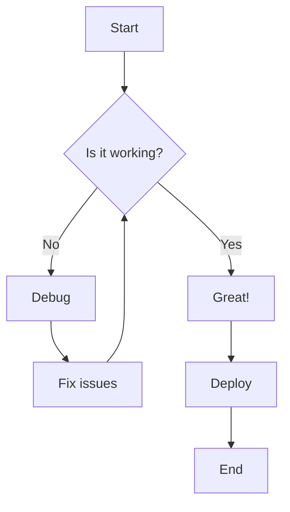
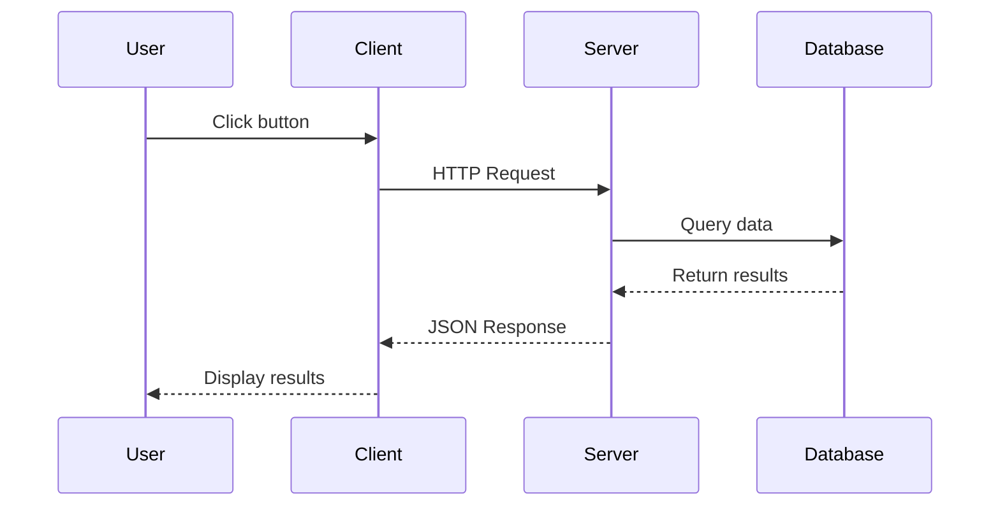
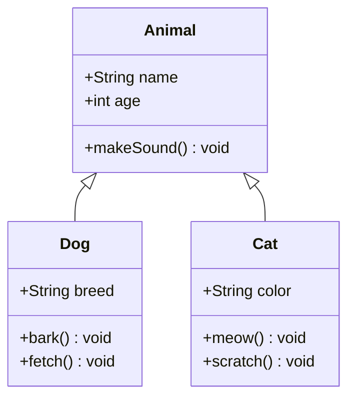
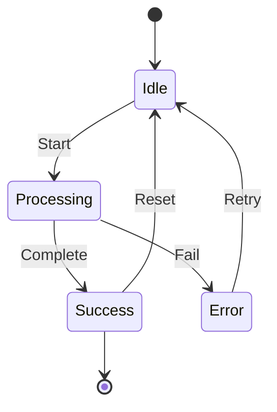
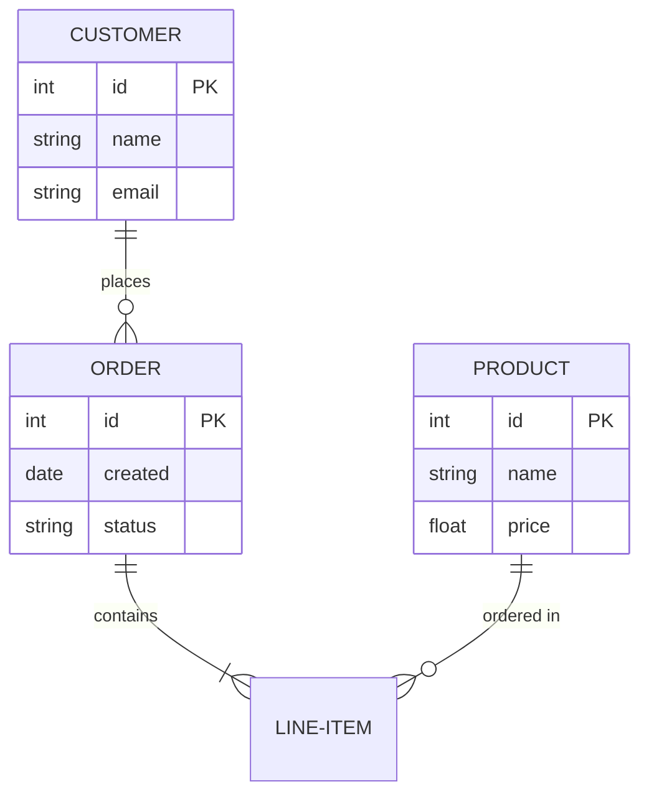
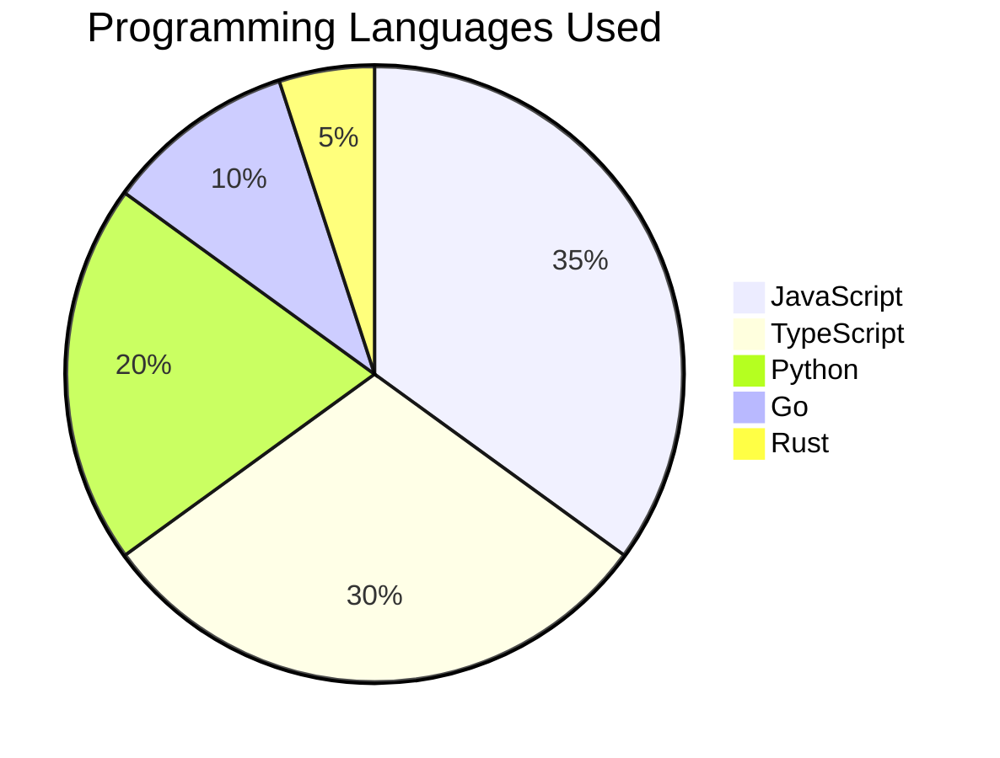
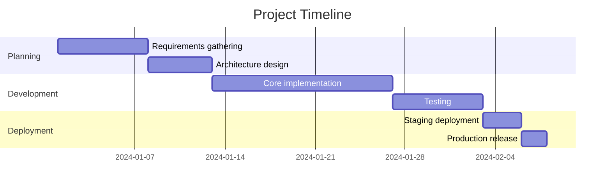
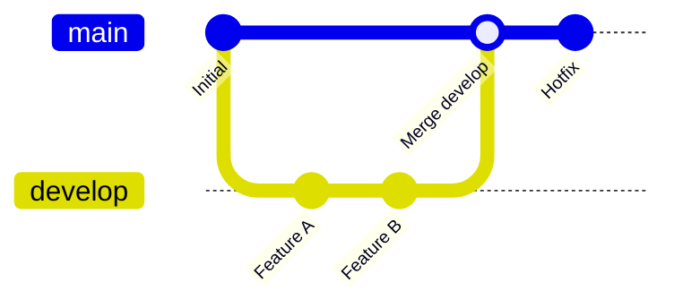

# MD Preview PDF Comprehensive Test Document

This document tests all markdown features supported by the MD Preview PDF converter.

${toc}

---

## 1. Basic Typography

### 1.1 Text Formatting

This is a paragraph with **bold text**, *italic text*, ***bold and italic***, and ~~strikethrough text~~.

You can also use `inline code` for technical terms.

This is a sentence with a footnote[^1].

[^1]: This is the footnote content.

### 1.2 Headings

The document supports all heading levels from H1 to H6:

# Heading 1
## Heading 2
### Heading 3
#### Heading 4
##### Heading 5
###### Heading 6

---

## 2. Lists

### 2.1 Unordered Lists

- Item 1
- Item 2
  - Nested item 2.1
  - Nested item 2.2
    - Deep nested item
- Item 3

### 2.2 Ordered Lists

1. First item
2. Second item
   1. Nested ordered item
   2. Another nested item
3. Third item

### 2.3 Task Lists

- [x] Completed task
- [x] Another completed task
- [ ] Incomplete task
- [ ] Another incomplete task

---

## 3. Code Blocks

### 3.1 JavaScript

```javascript
// JavaScript example with syntax highlighting
class Calculator {
  constructor() {
    this.result = 0;
  }

  add(num) {
    this.result += num;
    return this;
  }

  subtract(num) {
    this.result -= num;
    return this;
  }

  multiply(num) {
    this.result *= num;
    return this;
  }

  getResult() {
    return this.result;
  }
}

const calc = new Calculator();
console.log(calc.add(10).multiply(2).subtract(5).getResult()); // 15
```

### 3.2 Python

```python
# Python example with syntax highlighting
from typing import List, Optional
from dataclasses import dataclass

@dataclass
class Person:
    name: str
    age: int
    email: Optional[str] = None

def greet_people(people: List[Person]) -> None:
    """Greet a list of people."""
    for person in people:
        greeting = f"Hello, {person.name}!"
        if person.email:
            greeting += f" Your email is {person.email}"
        print(greeting)

# Usage
people = [
    Person("Alice", 30, "alice@example.com"),
    Person("Bob", 25),
]
greet_people(people)
```

### 3.3 TypeScript

```typescript
// TypeScript example
interface User {
  id: number;
  name: string;
  email: string;
  role: 'admin' | 'user' | 'guest';
}

async function fetchUser(id: number): Promise<User> {
  const response = await fetch(`/api/users/${id}`);
  if (!response.ok) {
    throw new Error(`Failed to fetch user: ${response.statusText}`);
  }
  return response.json();
}

// Generic function
function filterByProperty<T, K extends keyof T>(
  items: T[],
  property: K,
  value: T[K]
): T[] {
  return items.filter(item => item[property] === value);
}
```

### 3.4 SQL

```sql
-- SQL example
SELECT 
    u.id,
    u.name,
    u.email,
    COUNT(o.id) AS order_count,
    SUM(o.total) AS total_spent
FROM users u
LEFT JOIN orders o ON u.id = o.user_id
WHERE u.created_at >= '2024-01-01'
GROUP BY u.id, u.name, u.email
HAVING COUNT(o.id) > 5
ORDER BY total_spent DESC
LIMIT 10;
```

### 3.5 Shell/Bash

```bash
#!/bin/bash
# Shell script example

# Variables
PROJECT_NAME="md-preview-pdf"
VERSION="1.0.0"

# Functions
log() {
    echo "[$(date '+%Y-%m-%d %H:%M:%S')] $1"
}

# Main script
log "Starting $PROJECT_NAME v$VERSION"

# Check if npm is installed
if ! command -v npm &> /dev/null; then
    log "ERROR: npm is not installed"
    exit 1
fi

# Install dependencies
npm install

# Build project
npm run build

log "Build complete!"
```

---

## 4. Tables

### 4.1 Simple Table

| Feature | Status | Notes |
|---------|--------|-------|
| Markdown parsing | ✅ | Full GFM support |
| Syntax highlighting | ✅ | 150+ languages |
| Mermaid diagrams | ✅ | All diagram types |
| Math equations | ✅ | KaTeX |
| Custom themes | ✅ | GitHub, VS Code |

### 4.2 Aligned Table

| Left Aligned | Center Aligned | Right Aligned |
|:-------------|:--------------:|--------------:|
| Row 1 Col 1 | Row 1 Col 2 | Row 1 Col 3 |
| Row 2 Col 1 | Row 2 Col 2 | Row 2 Col 3 |
| Row 3 Col 1 | Row 3 Col 2 | Row 3 Col 3 |

---

## 5. Mermaid Diagrams

### 5.1 Flowchart



### 5.2 Sequence Diagram



### 5.3 Class Diagram



### 5.4 State Diagram



### 5.5 Entity Relationship Diagram



### 5.6 Pie Chart



### 5.7 Gantt Chart



### 5.8 Git Graph



---

## 6. Math Equations (KaTeX)

### 6.1 Inline Math

The famous equation $E = mc^2$ demonstrates the relationship between mass and energy.

The quadratic formula is $x = \frac{-b \pm \sqrt{b^2 - 4ac}}{2a}$.

### 6.2 Block Math

The integral of a function:

$$
\int_{a}^{b} f(x) \, dx = F(b) - F(a)
$$

Matrix notation:

$$
\begin{bmatrix}
a & b \\
c & d
\end{bmatrix}
\begin{bmatrix}
x \\
y
\end{bmatrix}
=
\begin{bmatrix}
ax + by \\
cx + dy
\end{bmatrix}
$$

Sum notation:

$$
\sum_{i=1}^{n} i = \frac{n(n+1)}{2}
$$

---

## 7. Blockquotes

> This is a simple blockquote.

> **Multi-paragraph blockquote:**
>
> This is the first paragraph.
>
> This is the second paragraph with *italic* and **bold** text.

> Nested blockquotes:
>
> > This is nested inside.
> >
> > > And this is even deeper.

---

## 8. Links and Images

### 8.1 Links

- [External link](https://github.com)
- [Link with title](https://github.com "GitHub Homepage")
- <https://example.com> (autolink)
- Email: <test@example.com>

### 8.2 Images

Images can be included with captions:


---

## 9. Custom Containers

::: tip Pro Tip
This is a tip container. Use it for helpful hints and best practices.
:::

::: warning Warning
This is a warning container. Use it to alert users about potential issues.
:::

::: danger Danger
This is a danger container. Use it for critical warnings.
:::

::: info Information
This is an info container. Use it for additional information.
:::

::: note Note
This is a note container. Use it for side notes.
:::

::: details Click to expand
This content is hidden by default and can be expanded by clicking the summary.

- You can include any markdown content here
- Including lists, code, and more!
:::

---

## 10. Horizontal Rules

---

***

___

---

## 11. Special Characters and Emoji

### 11.1 Emoji

Emoji support using shortcodes:

- :smile: Happy
- :rocket: Launch
- :star: Star
- :heart: Love
- :thumbsup: Approved
- :warning: Warning
- :bulb: Idea
- :memo: Note

### 11.2 HTML Entities

- Copyright: &copy;
- Registered: &reg;
- Trademark: &trade;
- Em dash: &mdash;
- En dash: &ndash;
- Less than: &lt;
- Greater than: &gt;
- Ampersand: &amp;

---

## 12. Keyboard Keys

Press <kbd>Ctrl</kbd> + <kbd>C</kbd> to copy.

Press <kbd>Ctrl</kbd> + <kbd>V</kbd> to paste.

Press <kbd>Cmd</kbd> + <kbd>Shift</kbd> + <kbd>P</kbd> to open command palette.

---

## 13. Subscript and Superscript

- Water formula: H<sub>2</sub>O
- E = mc<sup>2</sup>
- CO<sub>2</sub> emissions

---

## 14. Abbreviations

The HTML specification is maintained by the W3C.

*[HTML]: Hyper Text Markup Language
*[W3C]: World Wide Web Consortium

---

## 15. Mixed Content Example

Here's a complex example combining multiple features:

> **Important Note:** When using the `Calculator` class below, make sure to handle the following:
>
> 1. Initialize properly
> 2. Chain methods correctly
> 3. Handle errors
>
> ::: warning
> Division by zero will throw an error!
> :::

```javascript
class AdvancedCalculator extends Calculator {
  divide(num) {
    if (num === 0) {
      throw new Error('Division by zero');
    }
    this.result /= num;
    return this;
  }
}
```

The result can be expressed as: $result = \frac{a + b}{c}$

---

## Conclusion

This test document covers:

| Category | Features Tested |
|----------|----------------|
| Typography | Headers, bold, italic, strikethrough |
| Lists | Ordered, unordered, task lists |
| Code | Syntax highlighting for multiple languages |
| Tables | Simple and aligned tables |
| Diagrams | 8 types of Mermaid diagrams |
| Math | Inline and block KaTeX equations |
| Other | Blockquotes, containers, emoji, etc. |

---

*Generated by MD Preview PDF*
